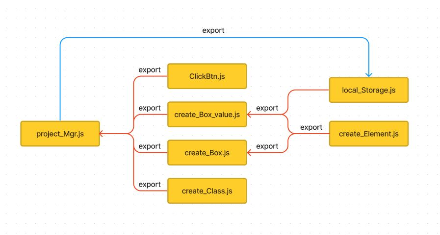

# BookChecker
각 함수를 파일들로 분산시키고 project_Mgr에서 각 스크립트들을 모듈화 해서 연결 시켰다.    

<br>

각 함수들의 export를 기준으로 도식화한 이미지는 아래와 같다.   
[export/import](https://ko.javascript.info/import-export)   
</img>   
<br>

* 각 스크립트를 모듈화하기 위해선 import와 export를 해야한다.
> import는 아래와 같다.       ref : js/create_Element.js
> > <pre><code>{import { get_create_Element } from './create_Element.js';}</code></pre>  

<br>  

> export는 아래와 같다.       ref : js/create_Element.js
> > <pre><code>{export function get_create_Box(class_name, element, parent) {...}}</code></pre>   

<br>

* HTML에선 script태그의 type을 'module'로 지정을 해줘야 한다.
> type = 'module'은 아래와 같다.      ref : index.html
> > <pre><code>{<script type="module" src="./js/ClickBtn.js"></script>}</code></pre>  

<br>

저장 방식은 local storage를 사용했다.   
> type = local storage 저장 방식은 아래와 같다.    ref : local_Storage.js
> > 
```
export function set_local_Storage(key, value) {
  const name = window.localStorage.setItem(`${key}`, `${value}`);
  console.log('set');
  return name;
}
```   
<br>

함수의 overload방식을 구현하려고 했으나 미숙한 점이 있어서 아직은 구현하지 않았다.   
<br><br>

* 개발을 하면서 발생한 문제점 
1. click함수들이 모두 event를 사용하지 않고 직접 적으로 지정을 한 것      
```
//클릭시 생성 및 함수 선언
get_ClickBtn(input_btn, 'click', () => {
  let parent = get_create_Box('box_backColor', 'div', list);
  // let parent = get_create_Element('div');
  // list.appendChild(parent);
  get_create_Box_value('title_box', title.value, 'div', parent);
  get_create_Box_value('comment_box', comment.value, 'div', parent);
  //set_local_Storage(comment_value, title_value);
})
```     
> (ref : test/app.js) 위 코드를 보면 수 많은 태그들을 직접 지정해야했다. event 매개변수를 사용해서 코드를 수정할 필요가 있다.    
<br>   

2. form태그를 사용해서 submit과 같은 형식을 구성하지 못한 점     
```
<section>
    <h3>Create New List</h3>
    <div class="Create_box">
      Title : <input type="text" class="title">
      Comment : <input type="text" class="comment">
      <button class="input_btn">plus</button>
    </div>
  </section>
  <hr>
  <section>
```
> (test/index.html) 1번에서 참고한 코드와 동일하게 'click'만으로 구현을 했다. 이를 보완해야할 필요가 있다.      
<br>  

*submit을 사용할 때 addEventListener가 submit을 지칭하는 변수에 있어야 한다.      
<br>     

> 잘못된 예시
```
const input_btn = document.querySelector('.input_btn');

input_btn.addEventListener('submit', (e)=>{
  e.preventDefault();
  console.log("test"); 
  //=>event가 발생되지 않고 새로고침이 된다.
});

```
<br>

> 올바른 예시
```
const form_tag = = document.querySelector('.form_tag');

form_tag.addEventListener('submit', (e)=>{
  e.preventDefault();
  console.log("test"); 
  //=>event가 발생되고 정상적으로 수행되는 것을 볼 수 있다.
});
```
